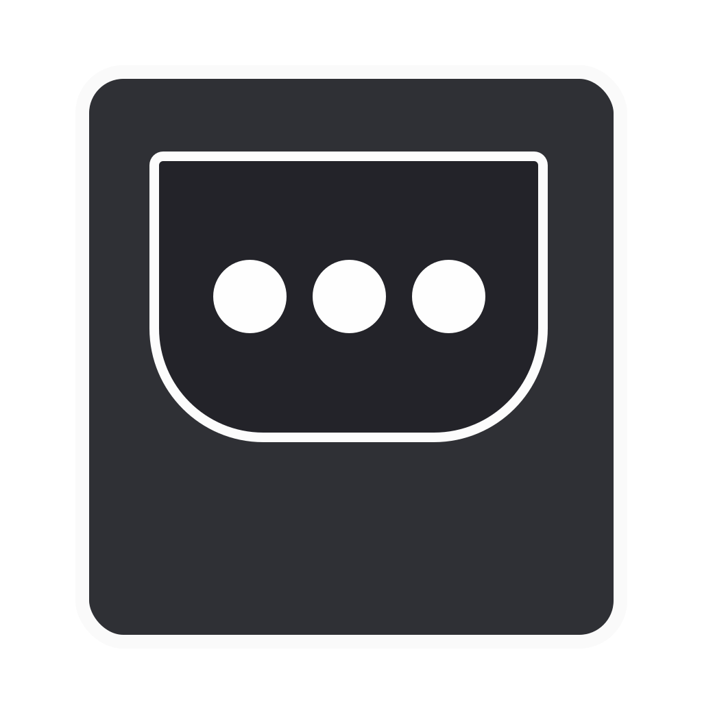
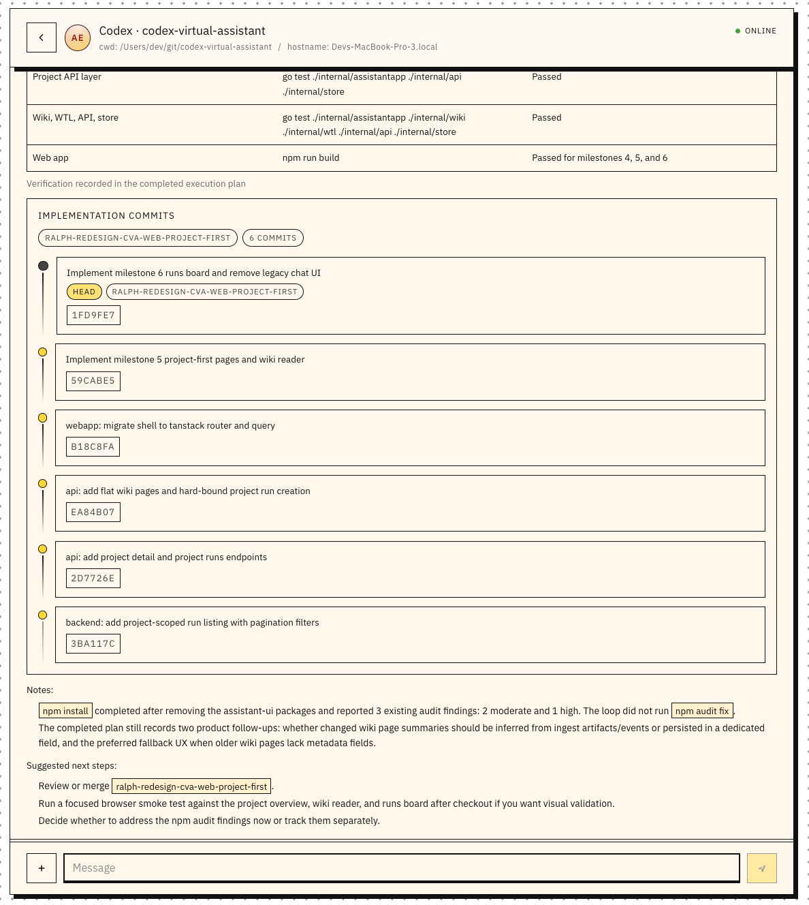

<p align="center">
  
</p>

# Agent Message

[한국어](README.ko.md) | [简体中文](README.zh-CN.md) | [繁體中文](README.zh-TW.md) | [日本語](README.ja.md)

<p align="center">
  
</p>


Agent Message is a direct-message stack with three clients:
- HTTP/SSE server (`server/`)
- Web app (`web/`)
- CLI (`cli/`)

Why Agent Message:
- Agents can use it directly because the messenger is exposed through a CLI.
- Messages can arrive in readable, structured formats through `json_render`.
- You can keep working with agents from your phone through the web app.
- `codex-message` and `claude-message` wrap Codex and Claude sessions so they can run through the same DM workflow.

Wrapper packages:
- `codex-message`: starts a Codex app-server session and relays the conversation through Agent Message.
- `claude-message`: starts a Claude CLI session and relays prompts, failures, and final replies through Agent Message.

The landing page is available at `https://amessage.dev`. The hosted cloud service is still in preparation; the recommended setup today is the self-hosted local stack.

## Supported Platforms

The published npm packages currently ship macOS builds only.

| Platform | Architecture | `agent-message` | `codex-message` | `claude-message` | Notes |
| --- | --- | --- | --- | --- | --- |
| macOS | Apple Silicon (`arm64`) | Supported | Supported | Supported | Primary packaged target |
| macOS | Intel (`x64`) | Supported | Supported | Supported | Packaged target |
| Linux | `x64` / `arm64` | Not packaged | Not packaged | Not packaged | Build from source only |
| Windows | `x64` / `arm64` | Not packaged | Not packaged | Not packaged | Not currently supported |

## Setup Prompt

Paste into Claude Code or Codex:

```bash
Set up https://github.com/siisee11/agent-message for me.

Read `install.md` and follow the self-host setup flow. Ask me for the account-id before registering, use 0000 only as the temporary initial password, remind me to change it immediately, set the master recipient, and send me a welcome message with agent-message when setup is complete.
```

## Quick Setup

Cloud service accounts are not available yet. Use the self-hosted local stack for now.

Use the setup prompt above when an agent is installing Agent Message for you.

Or install manually with npm:

```bash
npx skills add https://github.com/siisee11/agent-message --skill agent-message-cli -a codex -a claude-code -g -y
npm install -g agent-message
agent-message start
agent-message status
```

See `install.md` for the agent setup flow that conditionally installs `codex-message` when `codex` is present and `claude-message` when Claude Code is present.

Then create or log into a local account. Ask the user for the `account-id` before registering. Use `0000` only as the temporary setup password:

```bash
agent-message register <account-id> 0000
# or, if the account already exists:
agent-message login <account-id> 0000
```

Open `http://127.0.0.1:45788` in your browser and change the password immediately from the Profile page.
`agent-message start` launches the local stack and updates `~/.agent-message/config` so CLI traffic targets the started API at `http://127.0.0.1:45180`.

Set the public display name and default recipient for agent status reports:

```bash
agent-message username set <username>
agent-message config set master <recipient-username>
agent-message whoami
```

## Install With npm (macOS)

Install the packaged app from npm on macOS (`arm64` and `x64`).

The installed `agent-message` command keeps the existing CLI behavior and also adds local stack lifecycle commands:

```bash
agent-message start
agent-message status
agent-message stop
agent-message upgrade
agent-message uninstall
```

Default ports:
- API: `127.0.0.1:45180`
- Web: `127.0.0.1:45788`

For self-hosted local use, `agent-message start` creates and uses a local SQLite database by default.
The hosted cloud service is still in preparation. Future managed cloud deployments should run the server with `DB_DRIVER=postgres` and `POSTGRES_DSN`.
After `agent-message start`, open `http://127.0.0.1:45788` in your browser.
`agent-message start` also updates the bundled CLI config to use the started local API. Regular commands follow `server_url` in config unless you pass `--server-url`.
`agent-message uninstall` stops the local stack and removes the global npm package. It preserves `~/.agent-message` by default so local accounts, SQLite data, uploads, logs, and CLI profiles are not deleted accidentally. To remove that runtime data too, run `agent-message uninstall --purge`.
The bundled CLI continues to work from the same command:

```bash
agent-message register alice 0000
agent-message login alice 0000
agent-message username set jay-ui-bot
agent-message config set master jay
agent-message upgrade
agent-message ls
agent-message open bob
agent-message send bob "hello"
agent-message send "status update for master"
```

Port conventions:
- `8080`: source server default (`cd server && go run .`) and server container port
- `45180`: local API port used by `agent-message start`
- `45788`: local web gateway port used by `agent-message start`, `--with-tunnel`, and the containerized gateway
- `5173`: Vite dev server only

You can override the runtime location and ports when needed:

```bash
agent-message start --runtime-dir /tmp/agent-message --api-port 28080 --web-port 28788
agent-message status --runtime-dir /tmp/agent-message --api-port 28080 --web-port 28788
agent-message stop --runtime-dir /tmp/agent-message
```

Web Push for installed PWA notifications:
- `agent-message start` automatically creates and reuses a local VAPID keypair.
- The generated config is stored in `<runtime-dir>/web-push.json`.
- To override it, set `WEB_PUSH_VAPID_PUBLIC_KEY`, `WEB_PUSH_VAPID_PRIVATE_KEY`, and optionally `WEB_PUSH_SUBJECT` before `agent-message start`.
- iPhone web push needs the app to be installed from a public HTTPS origin. For local development, use `agent-message start --with-tunnel`; otherwise use a deployed HTTPS host.

PWA install:
- Open the deployed web app in Safari on iPhone.
- Use `Share -> Add to Home Screen`.
- The app now ships with a web app manifest, service worker, and Apple touch icon so it can be installed like a standalone app.

## Run From Source

This section covers local development and local production-like testing from a checked-out repository.

To expose the checked-out repository on your `PATH` as `agent-message`, run:

```bash
npm link
```

That symlinks this checkout's `npm/bin/agent-message.mjs`, so `agent-message ...` uses your local source tree.

## Prerequisites

- Go `1.26+`
- Node.js `18+` and npm
- Docker + Docker Compose (for PostgreSQL compose flow)

## Server Quickstart

### Option A: Local server with SQLite (default)

```bash
cd server
go run .
```

Default server settings:
- `SERVER_ADDR=:8080`
- `DB_DRIVER=sqlite`
- `SQLITE_DSN=./agent_message.sqlite`
- `UPLOAD_DIR=./uploads`
- `CORS_ALLOWED_ORIGINS=*`
- `WEB_PUSH_VAPID_PUBLIC_KEY`, `WEB_PUSH_VAPID_PRIVATE_KEY`, `WEB_PUSH_SUBJECT` are optional, but required if you want push notifications when running `go run .` directly

Example override:

```bash
cd server
DB_DRIVER=sqlite SQLITE_DSN=./dev.sqlite UPLOAD_DIR=./uploads \
WEB_PUSH_VAPID_PUBLIC_KEY=... \
WEB_PUSH_VAPID_PRIVATE_KEY=... \
WEB_PUSH_SUBJECT=mailto:you@example.com \
go run .
```

## Self-host Container Deploy

For a self-hosted Mac server, you can run the stack entirely with containers. The `gateway` image builds `web/dist` during `docker compose build`, so you do not need to run `npm run build` on the host first.

1. Copy the example env file and fill in your values:

```bash
cp .env.selfhost.example .env.selfhost
```

Required values:
- `APP_HOSTNAME`
- `POSTGRES_PASSWORD`
- `CLOUDFLARE_TUNNEL_TOKEN`

Web push keys are optional in `.env.selfhost`.
- If `WEB_PUSH_VAPID_PUBLIC_KEY` / `WEB_PUSH_VAPID_PRIVATE_KEY` are blank, the server container generates them on first boot and stores them in the `web_push_data` volume.
- If `WEB_PUSH_SUBJECT` is blank, it defaults to `https://<APP_HOSTNAME>`.
- On startup, the server container normalizes ownership for the `uploads` and `web_push_data` volumes before dropping privileges to the unprivileged `app` user.

2. Start the stack:

```bash
make publish
```

3. Check status:

```bash
docker compose --env-file .env.selfhost -f docker-compose.selfhost.yml ps
docker compose --env-file .env.selfhost -f docker-compose.selfhost.yml logs -f
```

4. Stop the stack:

```bash
make unpublish
```

The self-host stack includes:
- `postgres`
- `server`
- `gateway`
- `cloudflared`

No host port needs to be exposed on the Mac. Public traffic should come through Cloudflare Tunnel.

## Web Quickstart

```bash
cd web
npm ci
npm run dev
```

In local dev, Vite proxies `/api/...` and `/static/uploads/...` to `http://localhost:8080`, so you usually do not need `VITE_API_BASE_URL`.
If your API is on a different origin, set `VITE_API_BASE_URL`:

```bash
cd web
VITE_API_BASE_URL=http://localhost:8080 npm run dev
```

When `VITE_API_BASE_URL` is set, requests become cross-origin and the server must allow that origin via `CORS_ALLOWED_ORIGINS`.

Build check:

```bash
cd web
npm run build
```

## Cloudflare Workers Web Deploy

The current React web app can be deployed to Cloudflare Workers as static assets. This is intended for the public web surface first; the API-backed cloud service can be attached later.

```bash
cd web
npm ci
npm run deploy:worker
```

The Worker serves `web/dist` with SPA fallback enabled, so routes like `/login`, `/app`, and `/dm/:conversationId` resolve to the React app. Requests under `/api/*` and `/static/uploads/*` run through `web/worker/index.js` first.

Until the cloud API is ready, API requests return `503` from the Worker. When an API origin exists, set `API_ORIGIN` on the Worker and redeploy:

```bash
cd web
npx wrangler secret put API_ORIGIN
npm run deploy:worker
```

For example, `API_ORIGIN=https://api.amessage.dev` makes the existing web app keep using same-origin `/api/...` calls while the Worker proxies them to the API service. Assign `amessage.dev` as the Worker custom domain in Cloudflare after the first deploy.

## Local Lifecycle Commands

From a checked-out repo, use the same lifecycle command as the packaged app, but add `--dev` to build from the local source tree before launch:

```bash
agent-message start --dev
```

This will:
- build `web/dist`
- build the Go server binary into `~/.agent-message/bin`
- start the API on `127.0.0.1:45180`
- start the local web gateway on `127.0.0.1:45788`

To stop both processes:

```bash
agent-message stop --dev
```

If you also want to start or stop a configured named tunnel, use:

```bash
agent-message start --dev --with-tunnel
agent-message stop --dev
```

`--with-tunnel` assumes the default web listener `127.0.0.1:45788`, because the checked-in Cloudflare config points there.
Use `--with-tunnel` when testing iPhone push notifications from a local checkout; without a public HTTPS origin, Safari-installed PWAs will not receive web push reliably.

When publishing from the repo, `npm pack` / `npm publish` will run the package `prepack` hook, which:
- builds `web/dist`
- bundles `deploy/agent_gateway.mjs`
- cross-compiles macOS `arm64` and `x64` binaries for the Go CLI and API server into `npm/runtime/`

You can run the same packaging step manually from the repo root:

```bash
npm run prepare:npm-bundle
```

To publish all npm packages from the repo with the local Makefile:

```bash
make release
```

GitHub Actions can publish all three npm packages (`agent-message`, `codex-message`, `claude-message`) from a release tag. The workflow is `.github/workflows/npm-release.yml` and expects a tag in the form `v<semver>` such as `v0.6.13`. On tag push it validates the package versions, builds release tarballs on macOS, creates or updates the GitHub release, and publishes the tarballs to npm. The publish job uses npm trusted publishing with provenance when available, and can also fall back to `NPM_TOKEN` if you set that repository secret.

## Claude Code Skill

Install the Agent Message CLI skill to give Claude Code full knowledge of this project's CLI commands, flags, and json_render component catalog:

```bash
npx skills add https://github.com/siisee11/agent-message --skill agent-message-cli
```

## codex-message

`codex-message` is the Codex example app. It wraps `codex app-server` and uses `agent-message` as the DM transport.

Install:

```bash
npm install -g agent-message codex-message
```

Prerequisites:
- `agent-message` is installed and logged in
- the target user already has an `agent-message` account
- the `codex` CLI is installed and authenticated

Typical setup for a Codex user:

1. Set up `agent-message` first with the self-hosted local stack from the Quick Setup section above.
2. Set `agent-message` `master` to the person who should receive wrapper messages, or pass `--to` explicitly.
3. Start the wrapper.

```bash
agent-message config set master jay
codex-message --model gpt-5.4 --cwd /path/to/worktree
codex-message --model gpt-5.4 --cwd /path/to/worktree --yolo
codex-message --to alice --model gpt-5.4 --cwd /path/to/worktree
codex-message --bg --model gpt-5.4 --cwd /path/to/worktree
```

Build from source:

```bash
cargo build --manifest-path codex-message/Cargo.toml
./codex-message/target/debug/codex-message --model gpt-5.4
```

What happens next:
- `codex-message` creates a fresh `agent-{chatId}` account for this session
- it sends the target user a startup DM with the generated credentials
- it keeps one Codex app-server thread attached to that DM conversation
- inbound plain-text DMs are relayed into Codex
- approval, input, failure, and other wrapper-driven status prompts are sent back as `json_render` by the wrapper
- Codex is instructed to send the final user-facing result itself with `agent-message send --from agent-{chatId}`, typically as `json_render`

How the other user talks to it:

1. Open Agent Message in the browser or CLI.
2. Find the startup DM from the generated `agent-{chatId}` account.
3. Reply in plain text in that DM.
4. Read the structured result that comes back in the same conversation.

Useful flags:
- `--to <username>` overrides `agent-message` `master`
- `--cwd /path/to/worktree`
- `--model gpt-5.4`
- `--approval-policy on-request`
- `--sandbox workspace-write`
- `--network-access`
- `--yolo` = `--approval-policy never` + `--sandbox danger-full-access`

Background run:
- `codex-message --bg ...` detaches the wrapper and prints the PID, log path, and metadata path.
- Logs and metadata are written under `~/.agent-message/wrappers/codex-message/`.
- `codex-message list` shows running background sessions. Use `codex-message list --all` to include stale metadata.
- `codex-message kill <session-id|pid|all>` stops one session or every running background session.

## claude-message

`claude-message` is the Claude example app. It runs `claude -p --output-format json` and relays the session over `agent-message`.

Install:

```bash
npm install -g agent-message claude-message
```

Prerequisites:
- `agent-message` is installed and logged in
- the target user already has an `agent-message` account
- the `claude` CLI is installed and authenticated

Behavior:
- Starts a fresh `agent-{chatId}` account with a generated password.
- Sends the `--to` user a startup message with the generated credentials.
- Reuses the returned Claude `session_id` and resumes later turns with `--resume`.
- Watches the DM thread for plain-text prompts and instructs Claude to send the final user-facing result directly with `agent-message send --from agent-{chatId}`.
- If Claude fails, the wrapper posts a failure `json_render` notice itself.
- Leaves the agent's direct reply as the completion signal after a successful Claude turn.

Example:

```bash
claude-message --to jay --model sonnet --permission-mode accept-edits
claude-message --bg --to jay --model sonnet --permission-mode accept-edits
```

Typical setup for a Claude user:

1. Set up `agent-message` first with the self-hosted local stack from the Quick Setup section above.
2. Start the wrapper and point it at the person who will send requests over DM.
3. Have that person reply in the generated DM thread in the web app or CLI.

The setup is similar to `codex-message`: the wrapper creates a temporary `agent-{chatId}` account and listens for plain-text DMs in the same conversation. Successful turns now use the same delivery model too: the agent sends the final user-facing result directly, while the wrapper keeps responsibility for startup, reactions, and failure notices.

How the other user talks to it:

1. Open Agent Message in the browser or CLI.
2. Find the startup DM from the generated `agent-{chatId}` account.
3. Reply in plain text in that DM.
4. Read Claude's structured result in the same conversation.

Build from source:

```bash
make claude-message-build
./claude-message/target/debug/claude-message --to jay --model sonnet
```

Useful flags:
- `--to jay`
- `--cwd /path/to/worktree`
- `--model sonnet`
- `--permission-mode accept-edits`
- `--allowed-tools Read,Edit`
- `--bare`

Background run:
- `claude-message --bg ...` detaches the wrapper and prints the PID, log path, and metadata path.
- Logs and metadata are written under `~/.agent-message/wrappers/claude-message/`.
- `claude-message list` shows running background sessions. Use `claude-message list --all` to include stale metadata.
- `claude-message kill <session-id|pid|all>` stops one session or every running background session.

Notes:
- `claude-message` depends on a working local `claude` install and authentication.
- `claude-message` always runs Claude with `--dangerously-skip-permissions`.
- `--permission-mode` and `--allowed-tools` can still be used to shape tool behavior, but the wrapper no longer waits on Claude permission prompts.

## CLI Quickstart

Run from `cli/`. For self-hosting, start the local stack first with `agent-message start`, or point the source CLI at your local API with `--server-url` or `config set server_url`.

```bash
cd cli
go run . --server-url http://localhost:8080 register alice 0000
go run . --server-url http://localhost:8080 login alice 0000
go run . username set jay-ui-bot
go run . profile list
go run . profile switch alice
```

Common commands:

```bash
# Conversations
go run . ls
go run . open bob

# Messaging
go run . send bob "hello"
go run . send bob --attach ./screenshot.png
go run . send bob "see attached" --attach ./screenshot.png
go run . read bob --n 20
go run . edit 1 "edited text"
go run . delete 1

# Reactions
go run . react <message-id> 👍
go run . unreact <message-id> 👍

# Realtime watch
go run . watch bob
```

CLI config is stored at `~/.agent-message/config` by default.
Each successful `login` or `register` also saves a named profile, and `go run . profile switch <username>` swaps the active account locally.
`go run . onboard` is interactive and intended for human use. Agent setup should follow `install.md` instead: install the skill, install npm package, start the local stack, ask for `account-id`, then use `register` or `login`.
`go run . username set <username>` changes the public name shown in chats, and `go run . username clear` falls back to the `account_id`.
For bots, wrappers, or task-specific accounts, choose a username that is related to the chat topic or role so recipients can understand the conversation context at a glance.
For a self-hosted server, set `server_url` once with `go run . config set server_url http://localhost:8080` or use `--server-url` per command.
To set a default recipient for agent reports, run `go run . config set master jay`; after that, `go run . send "done"` sends to `jay`, and `go run . send --to bob "done"` overrides it for one command.

## Validation and Constraints (Phase 7)

- Account IDs and usernames: `3-32` chars, allowed `[A-Za-z0-9._-]`
- Password: `4-72` characters
- Uploads:
  - max file size: `20 MB`
  - unsupported file types are rejected

## Dev Checks

Server:

```bash
cd server
go test ./...
```

CLI:

```bash
cd cli
go test ./...
```

Web:

```bash
cd web
npm run build
```
